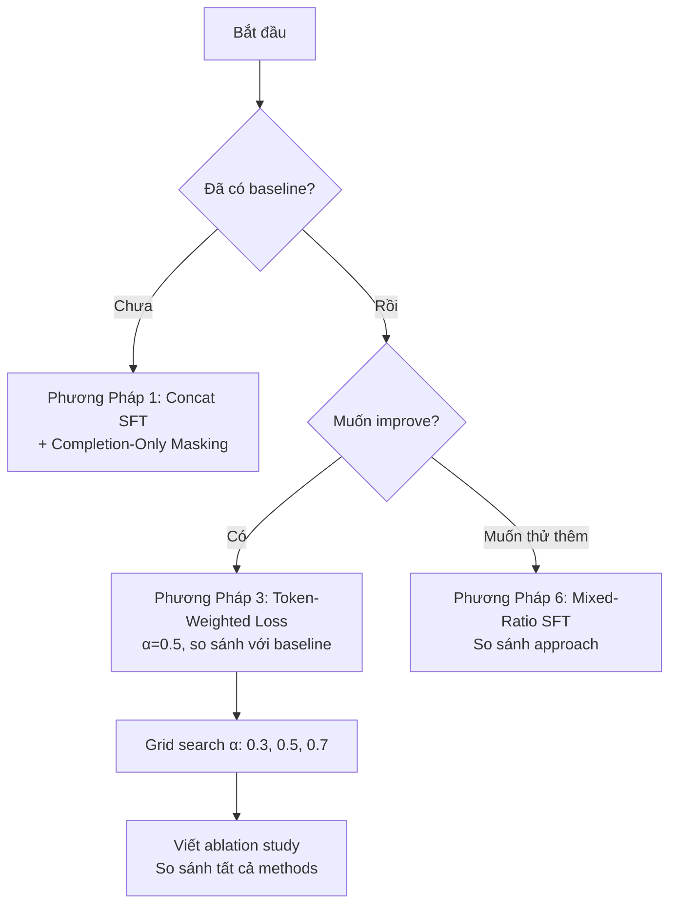

# Gemma Distillation Fine-tuning: Tất Cả Phương Pháp

> Tổng hợp các phương pháp fine-tune Gemma (decoder-only) để distill kiến thức rationale + label từ teacher LLM, sắp xếp từ đơn giản → phức tạp.

---

## Tổng Quan Vấn Đề

Paper gốc dùng **T5 (encoder-decoder)** với task-prefix approach: 2 forward riêng biệt (`predict:` + `explain:`), cộng loss với α. Gemma là **decoder-only** → không có multi-task prefix tự nhiên. Cần adapt.

**Bảng so sánh nhanh:**

| # | Phương Pháp | Độ Phức Tạp | α Control | Cần Custom Code | Phù Hợp KLTN |
|---|------------|-------------|-----------|-----------------|---------------|
| 1 | Concat SFT | ⭐ | ❌ | Không | ✅ Baseline |
| 2 | Completion-Only Masking | ⭐⭐ | ❌ | Ít | ✅ Nên dùng |
| 3 | Token-Weighted Loss | ⭐⭐⭐ | ✅ | Vừa | ✅ Recommend |
| 4 | Dual-Forward Weighted | ⭐⭐⭐⭐ | ✅ | Nhiều | 🟡 Nếu có thời gian |
| 5 | KL Logit Distillation | ⭐⭐⭐⭐⭐ | ✅ | Rất nhiều | ❌ Cần teacher online |
| 6 | Mixed-Ratio SFT | ⭐⭐ | ~α | Ít | ✅ Đơn giản |

---

## Phương Pháp 1: Concat SFT (Baseline — Đang Dùng)

### Ý tưởng
Ghép rationale + label vào 1 chuỗi, SFT bình thường.

### Format
```text
<bos><start_of_turn>user
Question: {input}<end_of_turn>
<start_of_turn>model
{rationale}
[answer: a]<end_of_turn><eos>
```

### Loss
$$L = \frac{1}{N}\sum_{i=1}^{N} CE(logit_i, target_i)$$

Tất cả token đều có trọng số bằng nhau → rationale (~100 tokens) lấn át label (~2 tokens).

### α tương đương: ~0.02 (label chiếm ~2% token)

### Code (Unsloth)
```python
from unsloth import FastModel
from trl import SFTTrainer
# Setup bình thường, không cần thay đổi gì
trainer = SFTTrainer(model=model, ...)
```

### Ưu/Nhược

| Ưu | Nhược |
|----|-------|
| Đơn giản nhất, plug-and-play | Label bị lấn át bởi rationale |
| Unsloth hỗ trợ native | Không kiểm soát được α |
| Nhanh — 1 forward/sample | Model học "viết giỏi" hơn "đoán đúng" |

---

## Phương Pháp 2: Completion-Only Masking

### Ý tưởng
Chỉ tính loss trên phần **response** (rationale + label), **bỏ qua prompt/instruction**. Giảm noise từ prompt tokens.

### Code (Unsloth)
```python
from unsloth import FastModel
trainer = SFTTrainer(model=model, ...)

# Unsloth's built-in — chỉ train trên response
from unsloth import train_on_responses_only
trainer = train_on_responses_only(
    trainer,
    instruction_part="<start_of_turn>user\n",
    response_part="<start_of_turn>model\n",
)
```

### Code (HuggingFace thuần)
```python
from trl import DataCollatorForCompletionOnlyLM

response_template = "<start_of_turn>model\n"
collator = DataCollatorForCompletionOnlyLM(
    response_template=response_template,
    tokenizer=tokenizer,
)

trainer = SFTTrainer(
    model=model,
    data_collator=collator,
    ...
)
```

### α tương đương: vẫn ~0.02 (nhưng ít noise hơn từ prompt)

### Ưu/Nhược

| Ưu | Nhược |
|----|-------|
| Loại bỏ noise từ prompt tokens | Vẫn không control α |
| Unsloth hỗ trợ 1 dòng code | Rationale vẫn dominate |
| Best practice chuẩn cho SFT | |

---

## Phương Pháp 3: Token-Weighted Loss (⭐ Recommend)

### Ý tưởng
Tính loss per-token với `reduction='none'`, rồi **gán weight cao hơn** cho token label. Mô phỏng chính xác α của paper gốc chỉ với 1 forward pass.

### Toán học
$$L = \alpha \cdot \frac{1}{|T_{label}|}\sum_{i \in T_{label}} CE_i + (1-\alpha) \cdot \frac{1}{|T_{rationale}|}\sum_{j \in T_{rationale}} CE_j$$

Trong đó $T_{label}$ là tập token thuộc phần `[answer: x]`, $T_{rationale}$ là tập token thuộc phần rationale.

### Code
```python
import torch
from trl import SFTTrainer

class WeightedDistillTrainer(SFTTrainer):
    def __init__(self, alpha=0.5, label_marker="[answer:", *args, **kwargs):
        super().__init__(*args, **kwargs)
        self.alpha = alpha
        # Token IDs cho marker phân tách rationale vs label
        self.label_marker_ids = self.tokenizer.encode(
            label_marker, add_special_tokens=False
        )
    
    def compute_loss(self, model, inputs, return_outputs=False, **kwargs):
        labels = inputs.get("labels")
        outputs = model(**inputs)
        logits = outputs.logits

        # Shift: causal LM predicts next token
        shift_logits = logits[..., :-1, :].contiguous()
        shift_labels = labels[..., 1:].contiguous()

        # Per-token CE loss (no reduction)
        loss_fn = torch.nn.CrossEntropyLoss(
            ignore_index=-100, reduction='none'
        )
        per_token_loss = loss_fn(
            shift_logits.view(-1, shift_logits.size(-1)),
            shift_labels.view(-1)
        ).view(shift_labels.shape)

        # Tạo mask: tìm vị trí [answer: trong labels
        label_mask = self._find_label_region(shift_labels)
        rationale_mask = (~label_mask) & (shift_labels != -100)

        # Weighted loss
        label_loss = per_token_loss[label_mask].mean() if label_mask.any() else 0.0
        rationale_loss = per_token_loss[rationale_mask].mean() if rationale_mask.any() else 0.0

        loss = self.alpha * label_loss + (1 - self.alpha) * rationale_loss

        return (loss, outputs) if return_outputs else loss

    def _find_label_region(self, labels):
        """Tìm vùng token thuộc phần [answer: ...] trong sequence."""
        batch_size, seq_len = labels.shape
        mask = torch.zeros_like(labels, dtype=torch.bool)
        
        marker_len = len(self.label_marker_ids)
        for b in range(batch_size):
            seq = labels[b]
            valid = seq[seq != -100]
            # Tìm vị trí marker trong sequence
            for i in range(len(valid) - marker_len + 1):
                if valid[i:i+marker_len].tolist() == self.label_marker_ids:
                    # Đánh dấu từ marker đến cuối
                    valid_positions = (seq != -100).nonzero(as_tuple=True)[0]
                    start_pos = valid_positions[i].item()
                    mask[b, start_pos:] = True
                    break
        return mask
```

### Cách dùng
```python
trainer = WeightedDistillTrainer(
    alpha=0.5,            # Giống paper gốc
    label_marker="[answer:",
    model=model,
    tokenizer=tokenizer,
    train_dataset=dataset,
    ...
)
```

### α tương đương: **Chính xác α** — user tự chọn

### Ưu/Nhược

| Ưu | Nhược |
|----|-------|
| Mô phỏng chính xác paper gốc | Cần custom Trainer |
| Chỉ 1 forward pass (efficient) | Marker detection có thể fragile |
| Control α tuỳ ý | Cần test kỹ mask logic |
| Tương thích Unsloth + LoRA | |

---

## Phương Pháp 4: Dual-Forward Weighted Loss

### Ý tưởng
Giống T5 nhất — tạo 2 prompt khác nhau, forward 2 lần qua cùng model, cộng loss. Đây chính là cách paper gốc hoạt động, adapt cho decoder-only.

### Format 2 prompts
```text
Prompt A (Label):
  "Predict the answer: {input}\nAnswer:"
  → Target: "a"

Prompt B (Rationale):
  "Explain your reasoning: {input}\nExplanation:"
  → Target: "Because the question asks about..."
```

### Code
```python
class DualForwardDistillTrainer(SFTTrainer):
    def __init__(self, alpha=0.5, *args, **kwargs):
        super().__init__(*args, **kwargs)
        self.alpha = alpha

    def compute_loss(self, model, inputs, return_outputs=False, **kwargs):
        # inputs chứa 2 bộ: 'label_*' và 'rationale_*'
        label_outputs = model(
            input_ids=inputs['label_input_ids'],
            attention_mask=inputs['label_attention_mask'],
            labels=inputs['label_labels'],
        )
        rationale_outputs = model(
            input_ids=inputs['rationale_input_ids'],
            attention_mask=inputs['rationale_attention_mask'],
            labels=inputs['rationale_labels'],
        )

        loss = self.alpha * label_outputs.loss + (1 - self.alpha) * rationale_outputs.loss

        return (loss, label_outputs) if return_outputs else loss
```

### Cần custom DataCollator
```python
class DualTaskCollator:
    """Tạo 2 bộ input/label từ 1 sample."""
    def __call__(self, features):
        # Mỗi feature có: input, rationale, label
        label_batch = self._make_label_batch(features)
        rationale_batch = self._make_rationale_batch(features)
        return {**label_batch, **rationale_batch}
```

### α tương đương: **Chính xác α**

### Ưu/Nhược

| Ưu | Nhược |
|----|-------|
| Giống paper gốc nhất | **2x compute** (2 forward) |
| α control chính xác | Custom DataCollator phức tạp |
| Tách biệt hoàn toàn 2 task | Khó tích hợp Unsloth |
| | VRAM tăng đáng kể |

---

## Phương Pháp 5: KL Logit Distillation

### Ý tưởng
Ngoài CE loss trên hard label, thêm **KL divergence** giữa logit distribution của teacher (chạy online) và student. Đây là distillation "đúng nghĩa" nhất.

### Toán học
$$L = \alpha \cdot CE(student, label) + \beta \cdot KL(softmax(z_t/\tau) \| softmax(z_s/\tau))$$

Với $\tau$ = temperature (thường 2-4), $z_t$ = teacher logits, $z_s$ = student logits.

### Yêu cầu
- Teacher model phải **chạy online** (forward song song với student)
- Cần lưu logits của teacher cho mỗi sample
- VRAM cực lớn (2 model cùng lúc)

### Code (Pseudo)
```python
class KLDistillTrainer(SFTTrainer):
    def __init__(self, teacher_model, temperature=2.0, alpha=0.5, beta=0.5, **kwargs):
        super().__init__(**kwargs)
        self.teacher = teacher_model.eval()
        self.temperature = temperature
        self.alpha = alpha
        self.beta = beta
    
    def compute_loss(self, model, inputs, return_outputs=False, **kwargs):
        student_outputs = model(**inputs)
        
        with torch.no_grad():
            teacher_outputs = self.teacher(**inputs)
        
        # CE loss cho hard label
        ce_loss = student_outputs.loss
        
        # KL loss cho soft label (logit matching)
        student_logits = student_outputs.logits / self.temperature
        teacher_logits = teacher_outputs.logits / self.temperature
        kl_loss = F.kl_div(
            F.log_softmax(student_logits, dim=-1),
            F.softmax(teacher_logits, dim=-1),
            reduction='batchmean'
        ) * (self.temperature ** 2)
        
        loss = self.alpha * ce_loss + self.beta * kl_loss
        return (loss, student_outputs) if return_outputs else loss
```

### Ưu/Nhược

| Ưu | Nhược |
|----|-------|
| Distillation mạnh nhất (dark knowledge) | Cần teacher model online → 2x VRAM |
| Học được soft distribution | Rất phức tạp implement |
| SOTA trong research | Không khả thi với GPT-3.5 (closed-source) |
| | Chỉ dùng khi teacher là open-source (vd: Gemma 27B → 1B) |

---

## Phương Pháp 6: Mixed-Ratio SFT

### Ý tưởng
Tạo **2 loại training sample** riêng biệt, trộn vào cùng dataset với tỷ lệ gần α. Không cần custom code.

### 2 loại sample
```text
Type A — Label Only (chiếm α%):
  User: {input}
  Model: [answer: a]

Type B — Rationale + Label (chiếm (1-α)%):
  User: {input}
  Model: {rationale}\n[answer: a]
```

### Code
```python
def create_mixed_dataset(data, alpha=0.5):
    samples = []
    for row in data:
        # α% chỉ có label
        if random.random() < alpha:
            samples.append({
                "text": format_label_only(row)
            })
        # (1-α)% có rationale + label
        else:
            samples.append({
                "text": format_rationale_and_label(row)
            })
    return samples
```

### α tương đương: ~α (xấp xỉ, không chính xác)

### Ưu/Nhược

| Ưu | Nhược |
|----|-------|
| Không cần custom code | α chỉ gần đúng |
| Hoạt động với mọi framework | Mỗi sample chỉ học 1 trong 2 task |
| Đơn giản, dễ hiểu | Không tận dụng rationale cho label prediction |

---

## Khuyến Nghị Cho KLTN



### Lộ trình đề xuất

1. **Bước 1 (Baseline):** Phương Pháp 1 + 2 — Concat SFT + Completion-Only Masking
2. **Bước 2 (Main contribution):** Phương Pháp 3 — Token-Weighted Loss với α = 0.5
3. **Bước 3 (Ablation):** Grid search α ∈ {0.3, 0.5, 0.7, 1.0} trên Phương Pháp 3
4. **Bước 4 (Bonus):** So sánh thêm Phương Pháp 6 (Mixed-Ratio) nếu có thời gian

> [!IMPORTANT]
> Phương Pháp 3 (Token-Weighted Loss) là **best balance** giữa tính chính xác toán học, hiệu quả compute (1 forward), và khả năng implement thực tế. Đây nên là **main contribution** của KLTN — mang framework α từ T5 sang Gemma.
